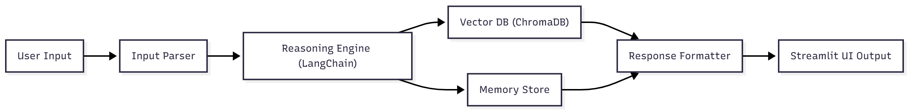

# Part 1 — Design and Plan Your AI Agent Workflow

---
## 1. Reflect on Your Agent Idea

**Agent Name**: Career Mentor AI

**User Problem**:
Many early-career professionals and career changers struggle to identify a clear, structured learning roadmap aligned with their goals in tech. They often waste time finding reliable resources or understanding which skills are most relevant to their target jobs.

**Target Domain**:
Personalized learning and career development for aspiring software engineers or technology professionals.

**Core Capabilities**:
- Gather user background information (skills, goals, learning time).
- Generate a personalized learning roadmap using AI reasoning and retrieval.
- Recommend curated learning materials (courses, GitHub projects, tutorials).
- Adapt recommendations based on user feedback and progress.

**Value Delivered**:
Career Mentor AI reduces the time and uncertainty of planning a self-learning path, helping users transition efficiently into technical roles through structured, adaptive guidance.

---
## 2. Framework, Architecture & Design Pattern

**Framework Choice**:
- ***LangChain*** – agent orchestration, memory, and retrieval
- ***FastAPI*** – clean and lightweight backend
- ***Streamlit*** – quick UI implementation
- ***ChromaDB*** – embedded vector database for resource retrieval

**Design Pattern**:
**Retrieval-Augmented Generation (RAG) + Memory**
The agent retrieves relevant learning materials from a curated vector knowledge base and integrates them with LLM reasoning to deliver personalized plans.

**Architecture**:
Hybrid layered architecture:
- UI Layer (Streamlit)
- Reasoning Layer (LangChain)
- Retrieval Layer (ChromaDB)
- Memory Layer (User state + progress)

**Justification**:
This stack offers high modularity, good performance, and minimal code complexity—ideal for a mid-difficulty course project with a professional career angle.

---
## 3. Workflow Mapping
**Input Types**:
- User background
- Target job role
- Available learning time
- Current skills

**Output Types**:
- Personalized learning roadmap
- Time breakdown
- Recommended resources
- Optional confidence scores

**Modules**:
- Input Parser
- Intent Understanding
- Planning Agent
- Retriever (ChromaDB)
- Resource Ranking
- Response Formatter
- Optional: Feedback loop + progress memory

---
## 4. Visual System Diagram

